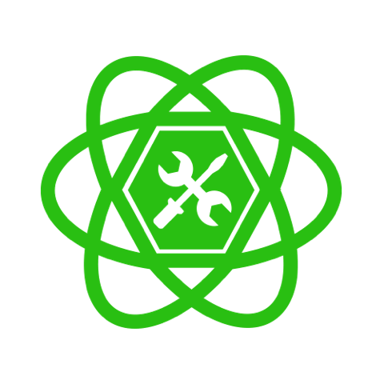

<div align="center" markdown="1">



## React Toolset

[](https://www.npmjs.com/package/@codespec/react-toolset)
[](https://www.npmjs.com/package/@codespec/react-toolset)

Independent set of React UI Components for your application.

</div>

### Install

```sh
# npm users
$ npm i --save @codespec/react-toolset

# yarn users
$ yarn add @codespec/react-toolset
```

### Documentation

- <a href="https://codespec.github.io/react-toolset/docs/" target="_blank">https://codespec.github.io/react-toolset/docs/</a>

### How to use

Since this react-toolset library is not compiling production package, you need to set up more things.

1. Set up Webpack configuration
  ```js
  // Add this loaders in your webpack.config.js
  // You should not exclude node_modules directory from it.
  // This is just an example.
  module: {
    loaders: [
      {
        test: /\.jsx?$/,
        loader: 'babel-loader',
        query: {
          cacheDirectory: true,
          presets: ['es2015', 'react'],
        },
      },
      {
        test: /\.scss$/,
        use: [
          { loader: 'style-loader' },
          {
            loader: 'css-loader',
            options: {
              modules:true,
              localIdentName: '[local]-[hash:base64:5]'
            }
          },
          {
            loader: 'sass-loader',
            options: {
              plugins: () => [require('autoprefixer')]
            }
          }
        ]
      },
    ]
  }
  ```
2. Import individual component from your application

  ```jsx
  import { Button } from '@codespec/react-toolset'
  ```
